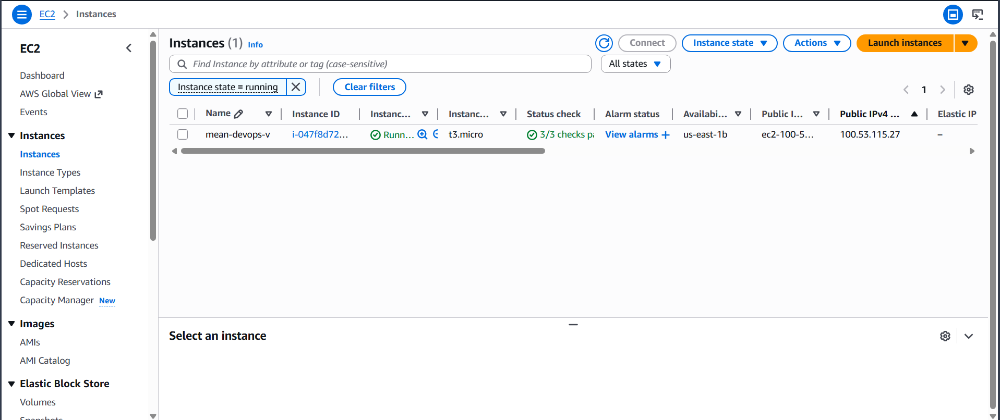
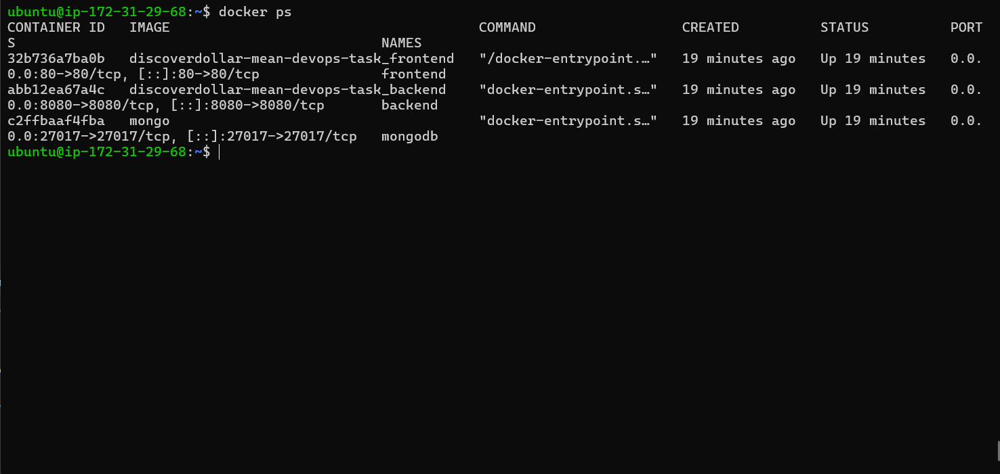
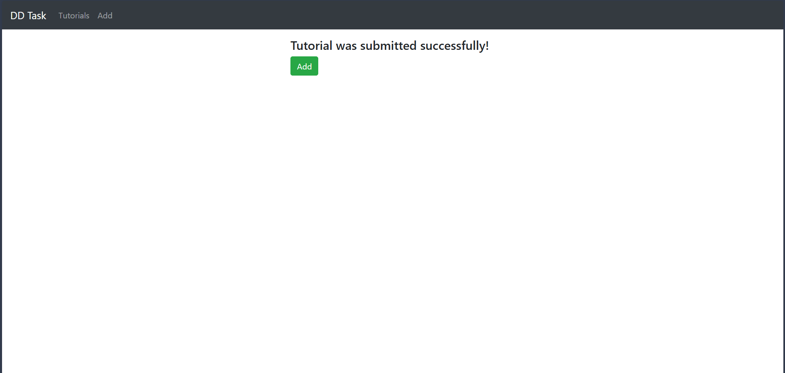
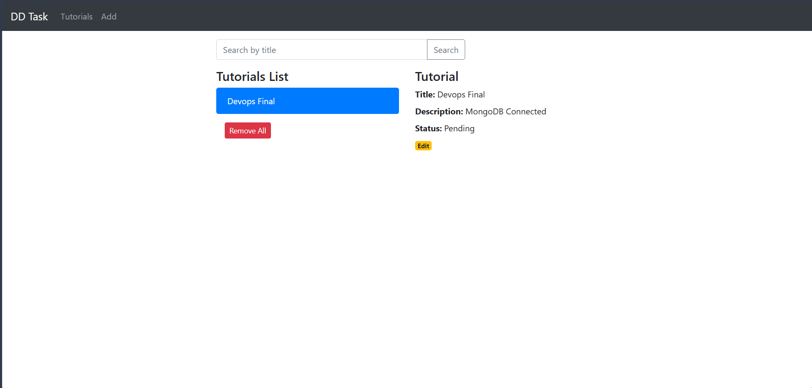
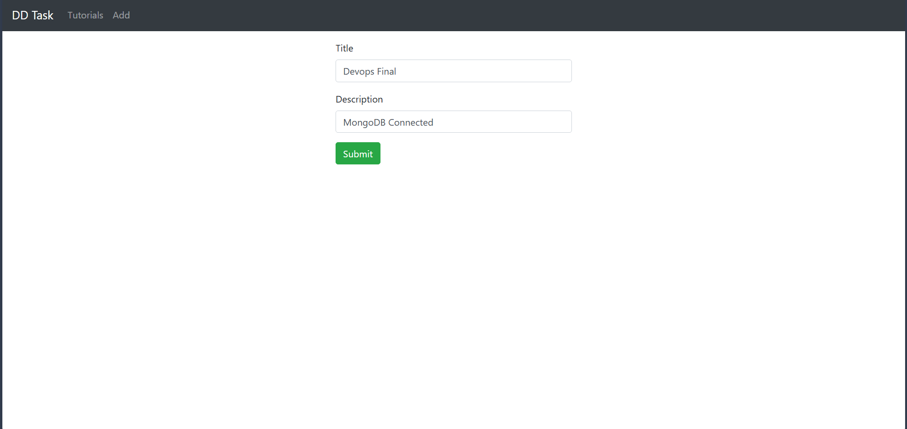
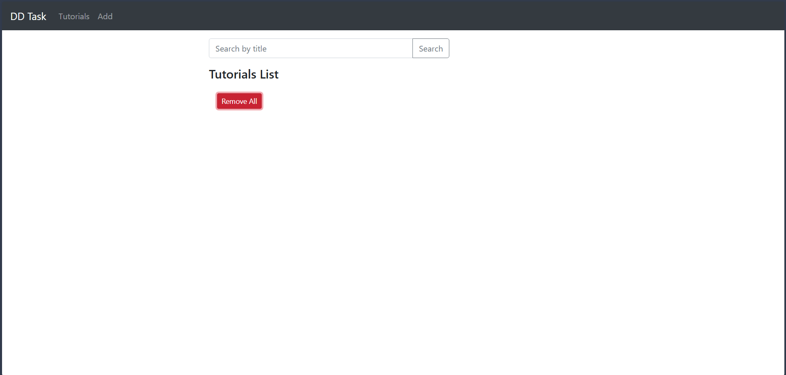
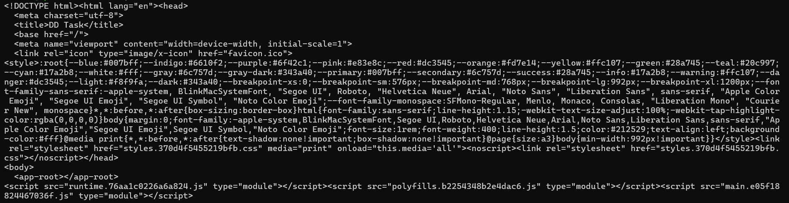

# MEAN Stack CRUD Application – Dockerized Deployment on AWS EC2

This repository contains a containerized full-stack CRUD application built using the MEAN stack (MongoDB, Express.js, Angular, Node.js).

The application has been deployed on an Ubuntu-based AWS EC2 instance using Docker and Docker Compose. Nginx is configured as a reverse proxy to serve the Angular frontend and route API requests to the backend service over port 80.

---

## Technology Stack

- Angular (Frontend)
- Node.js + Express (Backend)
- MongoDB (Database)
- Docker
- Docker Compose
- Nginx (Reverse Proxy)
- AWS EC2 (Ubuntu)

---

## Application Overview

The application provides a simple interface to manage tutorials. Users can perform the following operations:

- Create a new tutorial
- View all tutorials
- Update tutorial details
- Delete individual tutorials
- Remove all tutorials

The frontend communicates with the backend REST APIs, and all data is persisted in a MongoDB container.

---

## Containerized Architecture

The application is divided into three services:

- **Frontend** – Angular application served via Nginx
- **Backend** – Node.js + Express REST API
- **Database** – MongoDB official Docker image

Docker Compose is used to build and orchestrate all services together.

To build and start all containers:

```bash
docker-compose up -d --build
```

To verify running containers:

```bash
docker ps
```

---

## Deployment on AWS EC2

The application has been deployed on an Ubuntu EC2 instance (t3.micro) using Docker.

Deployment steps followed:

1. Launch Ubuntu EC2 instance
2. Install Docker and Docker Compose
3. Clone the repository
4. Build and run containers using Docker Compose
5. Configure EC2 Security Group to allow HTTP traffic (Port 80)
6. Configure Nginx reverse proxy to forward API requests to backend container

---

## Application Access

The deployed application is accessible via the EC2 public IP address:

```
http://100.53.115.27
```

---

## Deployment Verification

### EC2 Instance Running


---

### Docker Containers Running


---

### Application UI – Tutorials List


---

### Add Tutorial


---

### Edit Tutorial


---

### Submit Operation


---

### Remove All Tutorials


---

### Backend Connectivity Test


---

## Project Structure

```
backend/
frontend/
docker-compose.yml
README.md
```

---

## Notes

- MongoDB runs as a containerized service.
- Backend connects to MongoDB using Docker service name.
- Nginx is used to expose the Angular frontend via port 80.
- The EC2 instance has been retained for demonstration purposes if required.
