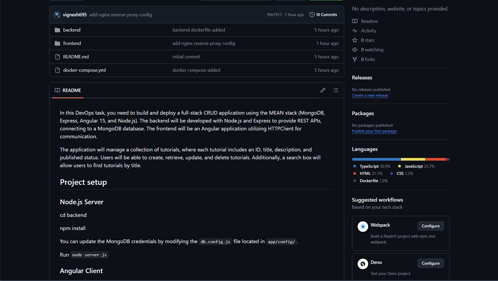

# MEAN Stack CRUD DevOps Deployment

This project demonstrates the deployment of a full-stack CRUD application using the MEAN stack (MongoDB, Express, Angular, Node.js) on AWS EC2 using Docker.

---

## 🚀 Deployment Steps

### 1️⃣ AWS EC2 Instance Created
- Instance Type: t3.micro
- Security Group Ports Opened:
  - 22 (SSH)
  - 80 (HTTP)
  - 8080 (Backend)


---

### 2️⃣ SSH into EC2 Instance

```bash
ssh -i your-key.pem ubuntu@your-public-ip
```

---

### 3️⃣ Docker Installation

```bash
sudo apt update
sudo apt install docker.io -y
sudo systemctl start docker
sudo systemctl enable docker
```

---

### 4️⃣ Clone Repository

```bash
git clone https://github.com/vignesh695/discoverdollar-mean-devops-task.git
cd discoverdollar-mean-devops-task
```

---

### 5️⃣ Run Docker Compose

```bash
docker-compose up -d --build
```

---

### 6️⃣ Verify Running Containers

```bash
docker ps
```


---

## 🌐 Application Running on Browser

Access using:

```
http://100.53.115.27
```


---

## ➕ CRUD Operations

### Add Tutorial


### Submit Tutorial


### View Tutorials


### Edit Tutorial


### Remove All


---

## 📂 GitHub Repository



---

## ✅ Application Successfully Deployed on AWS EC2 using Docker
