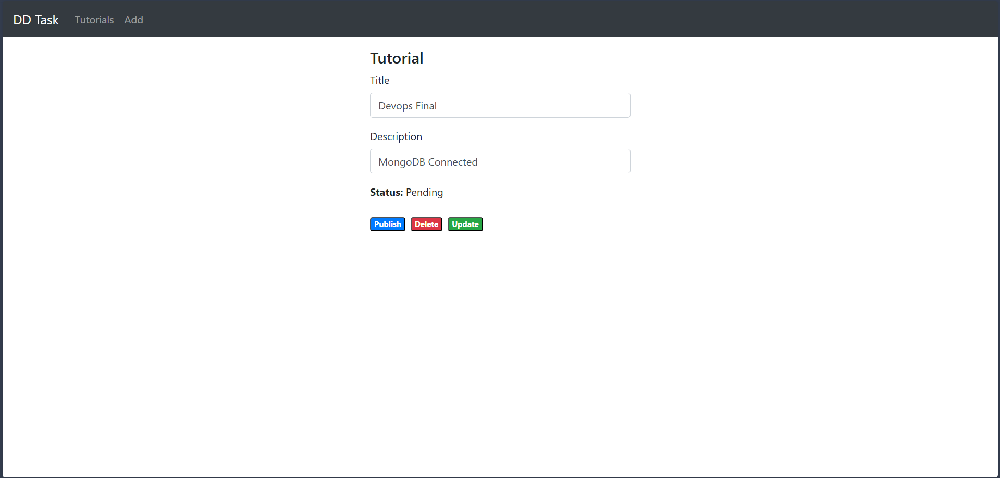

# 🚀 MEAN Stack CRUD Application Deployment using AWS EC2 & Docker

This project demonstrates the deployment of a full-stack CRUD application using:

- MongoDB
- Express.js
- Angular
- Node.js

The application is containerized using Docker and deployed on AWS EC2.

---

## 📦 Tech Stack

Frontend: Angular  
Backend: Node.js + Express  
Database: MongoDB  
Containerization: Docker + Docker Compose  
Cloud: AWS EC2 (t3.micro)

---

## ☁️ AWS EC2 Instance Running


---

## 🐳 Docker Containers Running in EC2


---

## 🌐 Application Running via Public IP


---

## 🔁 Backend Connectivity Test

Tested using:

```bash
curl localhost
```


---

## ✨ CRUD Operations

### 📌 Add Tutorial


---

### 📝 Edit Tutorial


---

### 📋 Tutorial List


---

### 🔄 Modify List



---

### ❌ Remove All


---

### 📤 Submit Operation


---

## 🧠 Deployment Steps

1. Launch EC2 Instance (Ubuntu)
2. Install Docker & Docker Compose
3. Clone Repository

```bash
git clone https://github.com/vignesh695/discoverdollar-mean-devops-task.git
cd discoverdollar-mean-devops-task
```

4. Run Docker Compose

```bash
docker-compose up --build -d
```

5. Access Application via Public IP

```
http://<EC2-PUBLIC-IP>
```

---

## 📌 Note

Infrastructure is kept running for CI/CD demonstration if required in next rounds.

---

## 👨‍💻 Author

Vignesh
